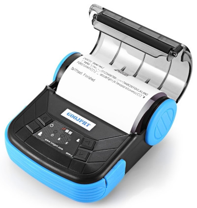

# dot_report

A simple report system for character based printers, mainly ESC/POS written in pure dart.

## Features

The report system let you to create a `list of integers` that can be sent to any character based printer.

It only produce the data to send, the way you use to send data depend on you, under Flutter you can use some lib to send data with bluetooth or wifi. I tried it with https://pub.dev/packages/bluetooth_thermal_printer and https://pub.dev/packages/flutter_bluetooth_printer. The second has the advantage that is distributed with Android and iOS source code and at time of writing is actively developed (See `dr_flutter2` example).

The main idea behind dot_report is to separate presentation from logic, and let the user to modify presentation without recompile source, so in flutter you can have a default reports and customized reports for each customer need.

Presentation script templates are written in yaml and contains placeholders which are replaced at runtime with actual data. A snippet of report looks like this:

```yaml
---
config:
  name: Test script
  description: invoice
  title: Invoice

bands:

  band:
    #          1         2         3         4
    # 123456789_123456789_123456789_123456789_12345678
    image: |
      \xxxxx \xxxxxxxxxxxxxxxxxxx \xx.xx \xx.xx \xx.xx

    values:
      - ["ED", "scu"]
      - ["W", "description"]
      - ["", "qt"]
      - ["", "price"]
      - ["", "qt*price"]

```

Each placeholder can be substituted with constants values or expressions from variables coming from your application.

The expression evaluator used to resolve formulas can be configured, but my choice is https://pub.dev/packages/expressions which is very powerful, can handle all types of data and also let you add functions to evaluator.

The system can handle fixed length forms for dot matrix printers and can be used to print on chemical paper, but with some limitations on print style.

But the most often usage in on thermic roll printers which do not need to respect height, so graphics and double height fonts can be mixed with normal fonts.

During preparing data to print you can add graphic and barcode if your printer support them. To print images and barcode I use https://pub.dev/packages/esc_pos_utils package that works on ESC/POS roll printers.

## Getting started

See on examples, pure dart example show some of the main features of the lib and flutter examples show how to integrate the lib in flutter with all tested bluetooth libraries.


## Usage

The Flutter examples provided are full documented and you can see the most of dot_report capabilities. But some explanations about workflow is required.

- The reporting starts with an instance of class DotReport or some derived class, as parameters you pass text of reports in yaml format.
- Then you can build a loop from your data and print bands with the `print` method, you have full freedom on data to print and how to print it using different bands for different data.
- At the end you call the method `close` to print footer.
- Once the report is closed, send the resulting `list of integers` to the printer.
- DotReport can handle some callback events used to prepare data or to summarize them.

### DotReport class

A simple call of DotReport is:

```dart
  rep = DotReport(
    [script1, script2],
    eval: evalExpression,
    onBefore: (rep) => brefore(rep),
    onBeforeBand: (band) => beforeBand(band),
    onAfterBand: (band) => afterBand(band),
  );
```

The first parameter required is a list of Strings with text of reports in yaml format. Usually scripts are stored as files on filesystem or into assets, so you must provide a way to load them into strings.

The second parameter is the evaluator function used to evaluate formulas presents in scripts.

Then there are some optional parameters, the most used are:
- `onBefore` is called before start printing and it is used to prepare some context data
- `onBeforeBand` is called before printing each band and it is used to set data to print on this band
- `onAfterBand` is called after each band and it is used to summarize data

Less frequent used parameters are:
- `onInit` is called by the method `init` but usuall is replaced by `onBefore` event.
- `onAfter` is called at the end of printing and it is used to cleanup data but is seldom required.
- `encoder` is the encoder used to transform from String to bytes, by default is `latin1`

dot_report by default uses ESC/POS commands to do some style, but if needed can be changed with:

```dart
  rep.cmd = MyCommands;
```

see the source code. You can also provide a `charReplacer` to use if your printer cant't handle some particular character used by your encoder:

```dart
  rep.charReplacer = {
    'è': "e'",
    'à': "a'",
    'ì': "i",
    'ò': "o'",
    'ù': "u'",
    'é': "e'",
  };
```

dot_report is pluggable and versatile, but at the moment the best results can be achieved using https://pub.dev/packages/expressions expression evaluator and https://pub.dev/packages/flutter_bluetooth_printer to send data to printer from Android.

I also advice to build a derived class as shown in examples.

### Yaml report script

Each report script in yaml format has two main keys, config and bands, config contain some parameters and band contain the list of printable bands.

#### `config`

The `config` key has some default values:

Name | Default | Description
---|---|---
name | '' | The name of the script, only descriptive value
description | '' | only descriptive value
title | '' | only descriptive value
page_length | 0 | length of each page in rows, 0 mean roll printing
logo | 'logo' | name of band used to print logo part, it is printed at each start of page
header | ['header','header'] | printed right after logo in first page print first element and from second page to end the second
footer | ['footer','footer'] | printed at the end of page, the first element is printed on last page the second on each page before the last
escape | \\~ | characters used to identify the start of field within image band
placeholders | x.@ | characters used as placeholder after escape within fields
cut_rows | 0 | number of empty rows to add at the end of report to adjust cutter position
page | 1 | page number, can be used to print page number on page reports

You can add your keys to `config` and use them as you like. In the examples I use the `scripts` key to automatically load all scripts needed for a report. This trick let you to split reports in snippet that can be used on more reports.

#### `bands`

At the `bands` key you can add as many bands that you want. Each band has is name and can be printed with method `print` i.e. with `rep.print('product')` you print the band called `'product'`.

There are some bands with special meaning as specified in `config` parameters, in short we have a `logo` band which is printed on top of each page, a `header` band which is printed for the first page and an `header` printed from second page and a `footer` band which is printed on last page and another `footer` band which is printed on all pages before the last. See the examples.

Each band is composed by an `image` and `values` that contain formulas to get values to replace placeholders in images:

```yaml
  product:
    #          1         2         3         4
    # 123456789_123456789_123456789_123456789_12345678
    image: |
      \xxxxx \xxxxxxxxxxxxxxxxxxx \xx.xx \xx.xx \xx.xx

    values:
      - ["B", "sku"]
      - ["", "description"]
      - ["2", "qt"]
      - ["R2", "iif(empty(price),'zero', price)"]
      - ["2S", "qt*price"]
```
In this case we have a band called `product` which has 5 placeholders. Each value is a list of 2 elements, the first contain style modifiers and the second the formula evaluated to context.

The style modifier recognized are:

- B Bold
- U Underline
- u another Underline style
- W Double width
- H Double Height
- D Double size (W+H)
- E Reverse mode
- 0-9 Nun. of decimals for numeric values
- S Space if zero for numeric values
- L force Left alignment
- R force Right alignment (numeric values are automatically aligned to right)

## Images and barcodes

dot_report does not handle graphics, but into the flow of bytes prepared to send to printer, images can be embedded.

I use https://pub.dev/packages/esc_pos_utils library to do that, it has reporting capabilities too, but using a different approach.

In my demo I used `image`, `barcode` and `qrcode` methods. Unluckily all these methods changes the printer configuration to print images to center, so after each call I needed to reset alignment.

## Printers

At the moment I tested dot_report with some printer models including https://goojprt.com/ MTP-3 printer, and it should work with all ESC/POS printers.




## Bug/Requests

Feel free to report bugs or requests.
